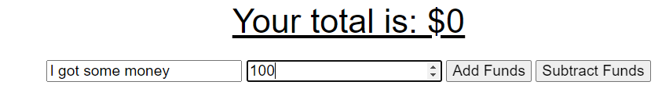

# Budget Tracker 

## Description

This is a simple application to use MVC model with node js to connect to mongoDB access REST apis. This is an application to view a budget tracker where you can input transactions to track your spending. The focus of this assignement is PWA and offline functionality when connection is unstable. The website is still functional and works with or without internet connectivity with express. 
Techonologies mongoDB, PWA, express, MVC model, service workers and cache.

## Link to Application

[Tech Blog  
 ](https://fabio-tech-blog.herokuapp.com/)

## Table of Contents

- [Installation](#installation)
- [Usage](#usage)
- [Credits](#credits)
- [License](#license)
- [Contribute](#contributions)
- [Tests](#tests)
- [Questions](#questions)

## Installation

This is for local install if you want to deploy the appliaction yourself

1. clone repo on github
2. Install any required dependancies

```
    npm install
```
3. Start the application on nodeJS

```
    npm start
```

## Usage

1. Once the application is started go to application website (default: https://localhost:3001)
2. Homepage, ability to see all posts,
     
3. Login page with option to create a new user   
   
   
4. Dashboard available after login.
   
5. Create new a post
     
6. Dashboard displays all posts created by user with ability to edit post
     
7. User can edit post content and title or delete post. Additionally user can also add comments to post here.
   
   
8. Clicking on Post title redirects to post details and comments
     

## Credits

N/A

## License

This application is under the MIT License  
For more information please view here: [MIT Description](https://choosealicense.com/licenses/mit/)

[](https://opensource.org/licenses/MIT)

## Contributions

Feel free to clone and improve on this application!

## Tests

[Demo Video](https://watch.screencastify.com/v/4vRBbrvRmK1lbjJbBTMd)

## Questions

See more about my Github here: [Fchoi1](https://www.github.com/Fchoi1)  
Any burning questions you want to ask me?  
Reach out to me! [fwchoi@uwaterloo.ca](mailto:fwchoi@uwaterloo.ca)
