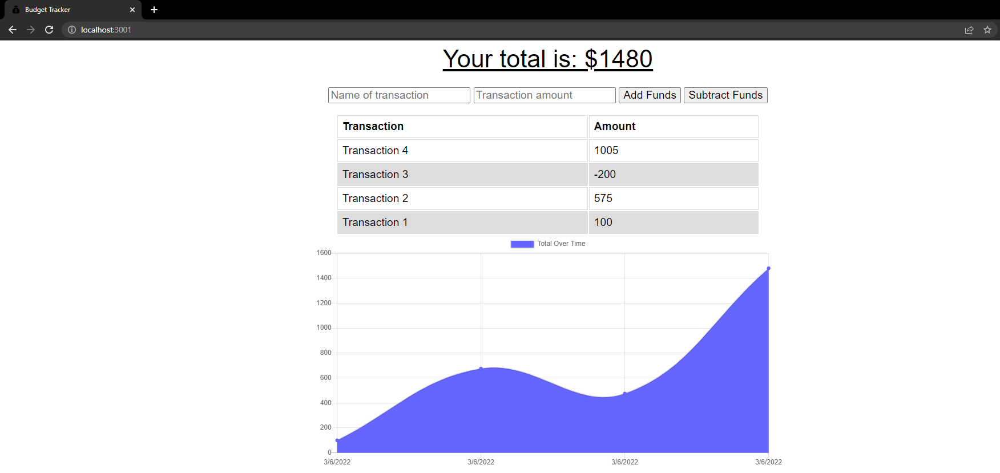
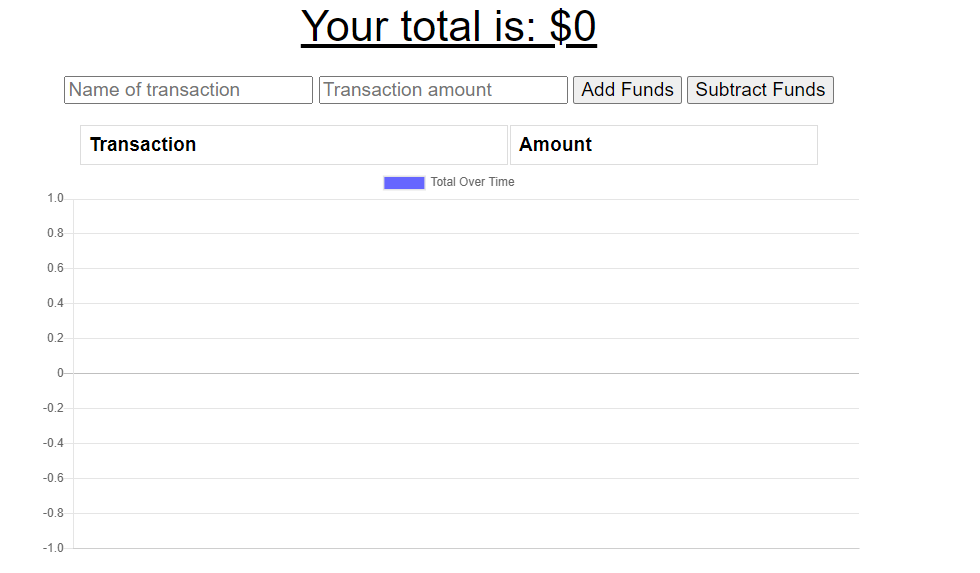
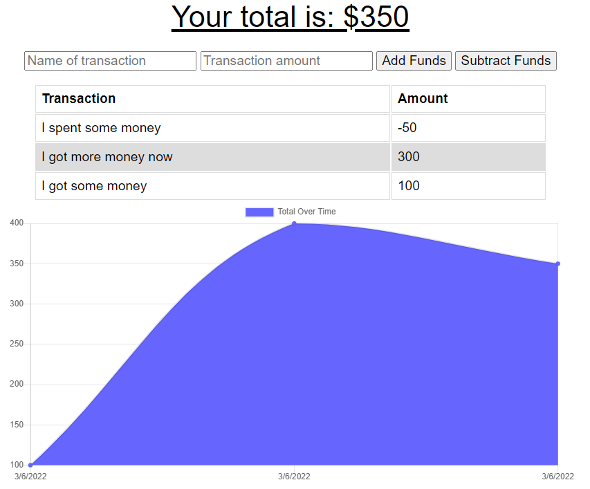
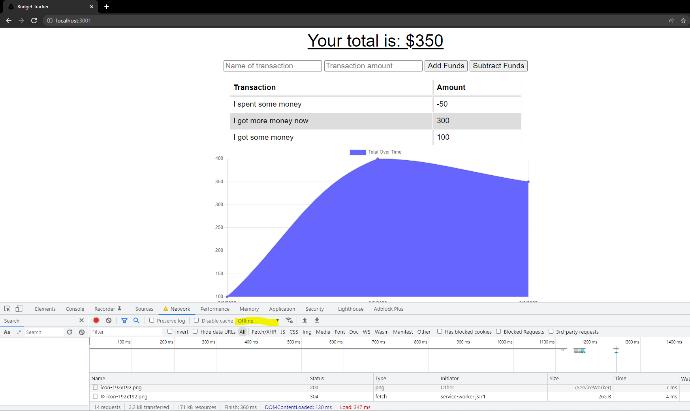

# Budget Tracker

## Description

This is a simple application to use MVC model with node js to connect to mongoDB access REST apis. This is an application to view a budget tracker where you can input transactions to track your spending. The focus of this assignement is PWA and offline functionality when connection is unstable. The website is still functional and works with or without internet connectivity with express.
Techonologies mongoDB, PWA, express, MVC model, Heroku, service workers and cache.

## Application

[Deployed application on Heroku](https://fabio-budget-tracker.herokuapp.com/)



## Table of Contents

- [Installation](#installation)
- [Usage](#usage)
- [Credits](#credits)
- [License](#license)
- [Contribute](#contributions)
- [Tests](#tests)
- [Questions](#questions)

## Installation

This is for local install if you want to deploy the appliaction yourself

1. clone repo on github
2. Install any required dependancies

```
    npm install
```

3. Start the application on nodeJS

```
    npm start
```

## Usage

1. Once the application is started go to application website (default: https://localhost:3000)
   
2. Enter Transaction Name and Ammount and select to add or subtract funds  
   
3. See live updates and history on the graph and chart with live total at the top
   

## Credits

N/A

## License

This application is under the MIT License  
For more information please view here: [MIT Description](https://choosealicense.com/licenses/mit/)

[](https://opensource.org/licenses/MIT)

## Contributions

Feel free to clone and improve on this application!

## Tests

This app also works in offline mode. Test with chrome dev tools!
Select network tab and offine mode. Refresh browser and the application still functions including adding and subtracting funds!  


## Questions

See more about my Github here: [Fchoi1](https://www.github.com/Fchoi1)  
Any burning questions you want to ask me?  
Reach out to me! [fwchoi@uwaterloo.ca](mailto:fwchoi@uwaterloo.ca)
